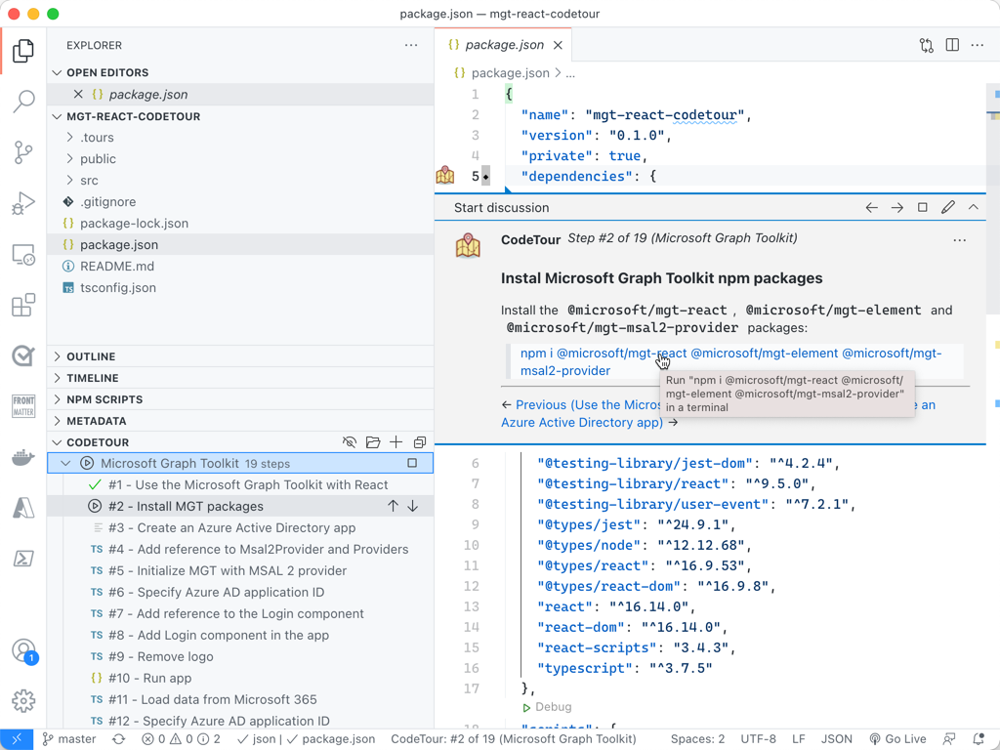
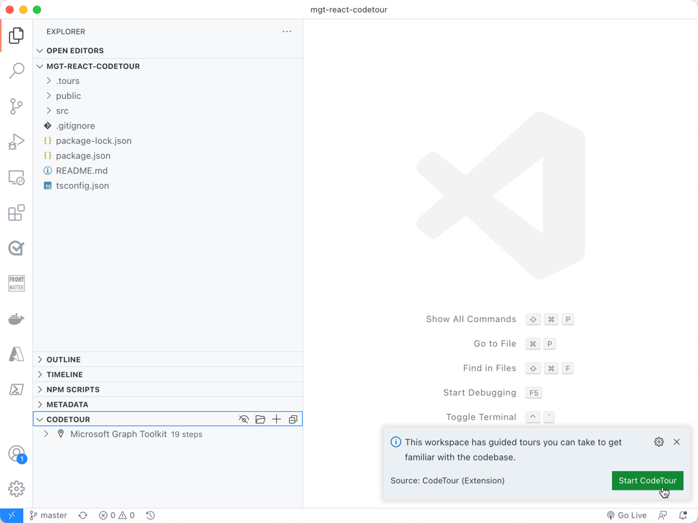
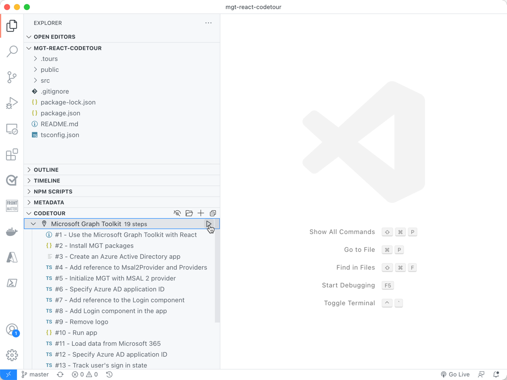

# Microsoft Graph Toolkit React code tour

This repo contains an interactive tour to help you build your first React app using [Microsoft Graph Toolkit](https://docs.microsoft.com/graph/toolkit/get-started/overview?tabs=html&WT.mc_id=m365-32079-wmastyka) - a collection of reusable, framework-agnostic components and authentication providers for accessing and working with Microsoft Graph. The contents of this tour are based on the [Use the Microsoft Graph Toolkit with React](https://docs.microsoft.com/graph/toolkit/get-started/use-toolkit-with-react?WT.mc_id=m365-32079-wmastyka) walkthrough. The starting point of the project is a React TypeScript app scaffolded using [Create React App](https://github.com/facebook/create-react-app).

## Prerequisites

- [Microsoft 365 developer tenant](https://developer.microsoft.com/microsoft-365/dev-program?WT.mc_id=m365-32079-wmastyka)
- [Visual Studio Code](https://code.visualstudio.com/?WT.mc_id=m365-32079-wmastyka)
- [Visual Studio Code CodeTour extension](https://marketplace.visualstudio.com/items?itemName=vsls-contrib.codetour&WT.mc_id=m365-32079-wmastyka)
- [Node.js LTS](https://nodejs.org/)

## Getting started

- clone the repo
- restore project dependencies by executing in the terminal: `npm install`
- open the project in Visual Studio Code
- when prompted, start the CodeTour:

    

- alternatively, you can start the tour manually from the CodeTour pane:

    

## We'd love your feedback

We'd love to hear from you what you think of this way of learning. If you like it, feel free to star the project and share it in your community. If you have suggestions how we could improve, please don't hesitate to create an issue in this repo.
